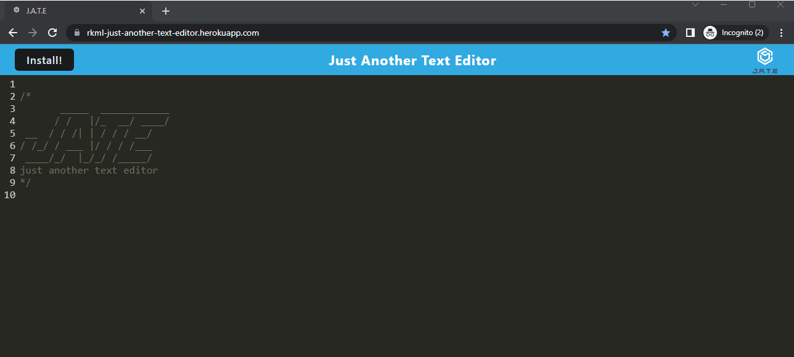
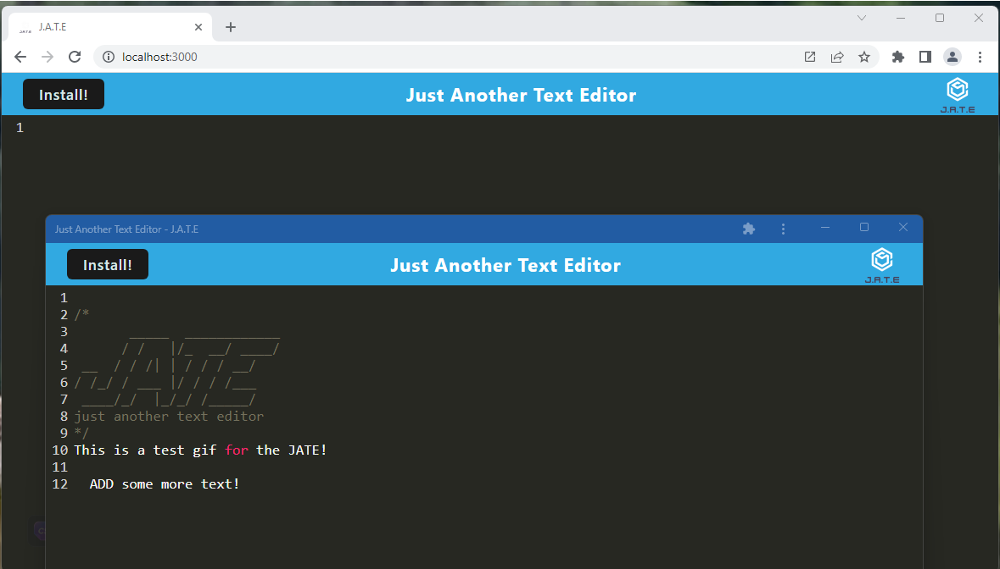

# Just Another Text Editor aka JATE!

## Description

This is a text editor application that runs in the browser and that can be downloaded and installed by the user on their own device.   This app is a single-page applicatoin that meets the PWA criteria!   Just Another Text Editor is there for all your note taking needs, both online  & offline!

## Table of Contents 
  - [Installation](#installation)
  - [Usage](#usage)
   - [License](#license)
   - [Contributing](#contributing)
   - [Test](#test)
   - [Questions](#questions)

## Installation

The following images provide a walkthrough on how to use the application.

You can run the application on <a href = "https://rkml-just-another-text-editor.herokuapp.com/">Heroku </a>, and have the opportunity to download it to your own device via the Install button!    Alternatively, you can download the repo, run the command prompt: npm install to create the package-lock.json and use npm start to run the application 

## Usage

<a href = "https://rkml-just-another-text-editor.herokuapp.com/"> Just Another Text Editor is available on Heroku!!! </a> 

A view of the installed version against the browser version:

## Contributing
If you would like to contribute to this application, please reach out to me via one of the means listed under Questions.

## Tests 

No tests for this one, except a lot of clearing of the caches!!!

A gif of the functionality of the website: 

## Credits

My favourite study buddy: <a href = "https://github.com/cassiewatsonn">Cassandra Watson </a>   

A thank you to <a href = "https://github.com/Tweakiel">Zeke</a> for the magic of just looking at my screen so that my code would work just fine!  I swear it wasn't working 2 seconds before you looked at it!  

My most amazing tutor: Dominique Meeks Gombe 

## License

MIT License 

## Questions

If you have any questions regarding this application, please contact me via one of the means below:

GitHub: <a href = "https://github.com/rkml14">Rebecca Lawrence </a>   
rkmlawrence@gmail.com  